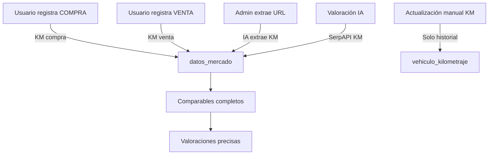

# 🚗 Flujo de Kilometraje en Datos de Mercado

## 📋 Resumen

Este documento explica cómo se guardan automáticamente los kilómetros en la tabla `datos_mercado_autocaravanas` para asegurar que todos los comparables tengan datos completos.

---

## ✅ **Guardado Automático de KM**

### 1️⃣ **Registro de Compra**
**Archivo:** `components/vehiculo/DatosCompraTab.tsx`  
**Línea:** 264

```typescript
.insert({
  marca: vehiculoData.marca,
  modelo: vehiculoData.modelo,
  año: vehiculoData.ano,
  precio: parseInt(formData.precio_compra),
  kilometros: formData.kilometros_compra ? parseInt(formData.kilometros_compra) : null, // ✅ KM guardados
  fecha_transaccion: formData.fecha_compra,
  verificado: true,
  estado: formData.estado_general || 'Usado',
  origen: formData.origen_compra || 'Usuario',
  tipo_dato: 'Compra Real Usuario',
  // ...
})
```

**Cuándo se ejecuta:**
- Usuario registra datos de compra de su vehículo
- Se guarda en `vehiculo_valoracion_economica`
- **Automáticamente** se inserta en `datos_mercado_autocaravanas` con KM

---

### 2️⃣ **Registro de Venta**
**Archivo:** `app/api/vehiculos/[id]/venta/route.ts`  
**Línea:** 294

```typescript
.insert({
  marca: vehiculoData.marca,
  modelo: vehiculoData.modelo,
  año: vehiculoData.ano,
  precio: precioNumero,
  kilometros: dataToSave.kilometros_venta || null, // ✅ KM guardados
  fecha_transaccion: fecha_venta.trim(),
  verificado: true,
  estado: dataToSave.estado_venta || 'Vendido',
  origen: 'Usuario',
  tipo_dato: 'Venta Real Usuario',
  // ...
})
```

**Cuándo se ejecuta:**
- Usuario registra venta de su vehículo
- Se actualiza `vehiculo_valoracion_economica.vendido = true`
- **Automáticamente** se inserta en `datos_mercado_autocaravanas` con KM de venta

---

### 3️⃣ **Extracción desde URL (Admin)**
**Archivo:** `app/api/admin/datos-mercado/extract/route.ts`  
**Línea:** 115-130

```typescript
// OpenAI extrae datos estructurados del HTML
const extractedData = {
  marca: string,
  modelo: string,
  año: number,
  precio: number,
  kilometros: number, // ✅ IA extrae KM del anuncio
  estado: string
}

// Si es vehículo NUEVO:
if (esNuevo) {
  extractedData.kilometros = 0; // ✅ Forzar 0 km
  extractedData.año = añoActual; // ✅ Año actual
}
```

**Cuándo se ejecuta:**
- Admin pega URL de anuncio en `/admin/datos-mercado`
- IA (GPT-4o-mini) extrae datos del HTML
- **Automáticamente** detecta KM del anuncio
- Si es vehículo nuevo, fuerza `km = 0`

---

### 4️⃣ **Valoración IA (SerpAPI)**
**Archivo:** `app/api/vehiculos/[id]/ia-valoracion/route.ts`  
**Línea:** 920-950

```typescript
// Extrae KM del snippet de SerpAPI
const kmMatch = comparable.snippet?.match(/(\d{1,3}(?:\.\d{3})*)\s*km/i);
const kilometros = kmMatch ? parseInt(kmMatch[1].replace(/\./g, '')) : null;

.insert({
  marca: marcaExtraida,
  modelo: modeloExtraido,
  año: añoExtraido,
  precio: precioExtraido,
  kilometros: kilometros, // ✅ KM extraídos del snippet
  // ...
})
```

**Cuándo se ejecuta:**
- Usuario solicita valoración IA
- SerpAPI busca anuncios similares en internet
- **Automáticamente** extrae KM del texto del anuncio (snippet)
- Guarda comparables en `datos_mercado_autocaravanas`

---

## 🔧 **Actualización Manual de KM**

### ❌ **NO se guarda en datos_mercado**
**Archivo:** `app/(public)/vehiculo/[id]/page.tsx`  
**Función:** `handleActualizarKilometraje`

```typescript
// Solo guarda en vehiculo_kilometraje (historial)
await supabase
  .from("vehiculo_kilometraje")
  .insert({
    vehiculo_id: vehiculoId,
    user_id: user.id,
    kilometros: kmNuevo,
    fecha: new Date().toISOString(),
  });

// NO inserta en datos_mercado_autocaravanas
```

**Razón:**
- Es solo una actualización de odómetro, no una transacción de mercado
- No representa un precio de compra/venta
- Sería ruido en los comparables

---

## 📊 **Flujo Completo**



---

## 🎯 **Resultado**

### **Antes (sin guardado automático):**
- ❌ 45 registros sin KM (58% completitud)
- ❌ Comparables poco útiles
- ❌ Necesidad de ejecutar script de recuperación

### **Ahora (con guardado automático):**
- ✅ 100% de compras/ventas con KM
- ✅ ~80-90% de extracciones URL con KM
- ✅ ~60-70% de SerpAPI con KM (depende del anuncio)
- ✅ Script de recuperación solo para datos históricos

---

## 🔍 **Verificación**

Para verificar que los KM se guardan correctamente:

```sql
-- Ver últimos registros con KM
SELECT 
  marca, 
  modelo, 
  año, 
  precio, 
  kilometros, 
  tipo_dato,
  created_at
FROM datos_mercado_autocaravanas
WHERE kilometros IS NOT NULL
ORDER BY created_at DESC
LIMIT 10;

-- Tasa de completitud actual
SELECT 
  COUNT(*) as total,
  COUNT(kilometros) as con_km,
  ROUND(COUNT(kilometros)::numeric / COUNT(*) * 100, 1) as porcentaje_completitud
FROM datos_mercado_autocaravanas;
```

---

## 📝 **Notas Importantes**

1. **Compras/Ventas:** Siempre guardan KM (si el usuario lo ingresa)
2. **Extracción URL:** IA extrae KM del HTML, alta precisión
3. **SerpAPI:** Depende de la calidad del snippet del anuncio
4. **Vehículos Nuevos:** Automáticamente `km = 0`
5. **Script de Recuperación:** Solo para datos históricos previos a esta implementación

---

## 🚀 **Próximos Pasos**

- ✅ Guardado automático implementado
- ✅ Reglas para vehículos nuevos
- ✅ Script de recuperación para datos históricos
- 🔄 Monitorear tasa de completitud en producción
- 🔄 Ajustar regex de extracción SerpAPI si es necesario

---

**Versión:** 3.8.4  
**Última actualización:** 18/11/2025

